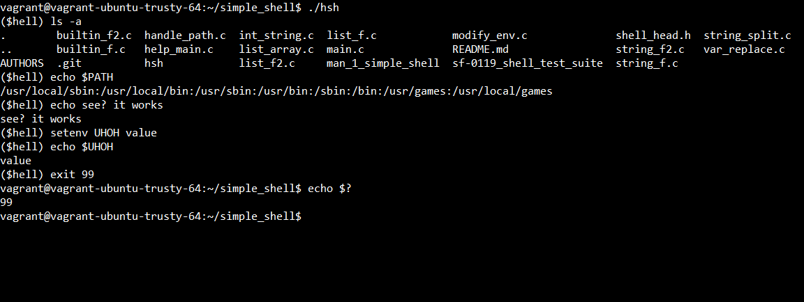

# simple_shell
A simple UNIX command interpreter.
## Description
This project was created as part of the third month curriculum at [Holberton School](https://www.holbertonschool.com/), San Francisco. In short, we we're required to write a UNIX command interpreter. Our shell replicates (to a certain degree) the `sh` shell. 

Due to it's simplicity, our custom-built shell has some of the functionalities of a normal shell, but not all of them. Down below we will describe each feature our shell contains.

### Compilation
To create an executable, compile the C files like this:
```
gcc -Wall -Werror -Wextra -pedantic *.c -o hsh (or any other name you desire)
```
Or this way (without error checking):
```
gcc *.c -o hsh
```
### Entering the Shell
Once compiled, use the executable file `hsh` to enter. Your output for the shell should look something like this:
```
$ ./hsh
($hell) 
```

If the prompt (`$hell`) shows up and not the normal `$`, you'll know that you are in our custom shell.

### Example Usage



### Exiting the Shell
To exit out of the shell, you can use either `CTRL + D`, or `CTRL + Z` or by typing in the built-in `exit` to the command line.

Do take note that the shell ignores the `CTRL + C` signal. When entered, the signal `^C` will be printed without exiting. To exit, use one of the inputs explained above. 

### Files
The following table describes in short the contents of each file in this repository.


File Name | Description
--- | ---
[builtin_f.c](https://github.com/ethanpasta/simple_shell/blob/master/builtin_f.c) | Contains the commands `exit`, `setenv` and `unsetenv`, as well as other helpful functions.
[builtin_f2.c](https://github.com/ethanpasta/simple_shell/blob/master/builtin_f2.c) | Contains the command `cd` builtin for change directory, as well as other helpful functions.
[handle_path.c](https://github.com/ethanpasta/simple_shell/blob/master/handle_path.c) | Contains functions that handle the PATH environment variable.
[help_main.c](https://github.com/ethanpasta/simple_shell/blob/master/help_main.c) | Contains various helpful functions for the `main.c` file (main functionality of the program). 
[int_string.c](https://github.com/ethanpasta/simple_shell/blob/master/int_string.c) | Contains `itoa` and `atoi` functions.
[list_array.c](https://github.com/ethanpasta/simple_shell/blob/master/list_array.c) | Contains functions to converts an array of strings into a linked list and vice versa.
[list_f.c](https://github.com/ethanpasta/simple_shell/blob/B/list_f.c) | Contains various linked lists functions.
[list_f2.c](https://github.com/ethanpasta/simple_shell/blob/B/list_f2.c) | Contains more function for linked lists operations.
[main.c](https://github.com/ethanpasta/simple_shell/blob/master/main.c) | Entry point for the shell, and main loop for the program.
[man_1_simple_shell](https://github.com/ethanpasta/simple_shell/blob/master/man_1_simple_shell) | The man page for our simple shell. Type in `man ./man_1_simple_shell` to see the man page.
[modify_env.c](https://github.com/ethanpasta/simple_shell/blob/master/modify_env.c) | Contains functions that are used for thr `setenv` and `unsetenv` built-in commands.
[shell_head.h](https://github.com/ethanpasta/simple_shell/blob/master/shell_head.h) | Header file that contains all libraries, function prototypes, and structs definitions.
[string_f.c](https://github.com/ethanpasta/simple_shell/blob/master/string_f.c) | Contains custom built string functions- `_strlen`, `_puts` (personalized versions of built-in functions).
[string_f2.c](https://github.com/ethanpasta/simple_shell/blob/B/string_f2.c) | Contains more custom built string functions.
[string_split.c](https://github.com/ethanpasta/simple_shell/blob/master/string_split.c) | Contains custom built strtok function - `strtow`.
[var_replace.c](https://github.com/ethanpasta/simple_shell/blob/master/var_replace.c) | Handles variable replacements. Mainly, used for the `echo $?` command.

### Output
Once compiling our program, you can see that our shell has the same output and same error messages as the normal shell would.
#### `sh`
```
$ echo "qwerty" | /bin/sh
/bin/sh: 1: qwerty: not found
$ echo "qwerty" | /bin/../bin/sh
/bin/../bin/sh: 1: qwerty: not found
$
```
* The error message is personalized to your exacutable filename, in this case `hsh`.
#### `./hsh` (our shell)
```
($hell) echo "qwerty" | ./hsh
./hsh: 1: qwerty: not found
($hell) echo "qwerty" | ./././hsh
./././hsh: 1: qwerty: not found
($hell)
```
## Interactive vs Non-Interactive
Our shell works in two different modes, interactive and non-interactive.

### Interactive Mode
The classic shell. Every time a command is entered, the prompt appears again and waits for the next user input:
```
$ ./hsh
($hell) /bin/ls
AUTHORS handle_path.c  int_string.c  main.c
($hell)
($hell) exit
$
```

### Non-Interactive Mode
Piping a command into the executable file. Our shell executes the command, and exits the shell. 
```
$ echo "/bin/ls" | ./hsh
AUTHORS handle_path.c  int_string.c  main.c
$
$ echo "pwd" | ./hsh
/vagrant/home/
$
$ echo "ls -a" | ./hsh
AUTHORS handle_path.c  int_string.c  main.c .git . ..
$
```
### Built-in Commands
The shell includes the following built-in commands.

Each one of the custom built-in commands can be compared to the the normal `sh` shell output.
* **exit**
  * Usage - `$ exit` or `$ exit [VALUE]`
  * When entered correctly (valid exit value or nothing), the user exits the shell. The exit value will be the parameter passed, or the return value of the latest command if no value was passed.
  * You can see the exit value by entering `echo $?` after exiting the shell.

* **env**
  * Usage - `$ env`
  * When entered, all of the current environment variables and their values are displayed.

* **setenv**
  * Usage - `$ setenv [VARIABLE] [VALUE]`
  * When entered, either a new environment variable is created, or an existing one is modified.
  * If an error occurs (e.g. no parameters included), a message is displayed in the standard error output.

* **unsetenv**
  * Usage - `$ unsetenv [VARIABLE]`
  * When entered, an environment variable is removed.
  * If an error occurs (e.g. variable not found, no parameters included), a message is displayed in the standard error output.

* **cd**
  * Usage - `$ cd [DIRECTORY]`
  * When entered, the current working directory is changed.
  * `cd -`: changes the working directory to the previous one.
  * `cd`: if no argument is entered, the command is interpreted as `cd $HOME`
  * If an error occurs (e.g. directory is not valid), a message is displayed in the standard error output.

### Variable Replacements
Our shell knows to replace variables with `$`.
  * `echo $PATH`: the variable `PATH` gets replaced with its value.
  * `echo $$`: the current process ID is displayed.
  * `echo $?`: the return/exit value of the last command entered is displayed.

[1.1]: http://i.imgur.com/tXSoThF.png (twitter icon with padding)
[6.1]: http://i.imgur.com/0o48UoR.png (github icon with padding)
[1]: http://www.twitter.com/eitanmayer57
[6]: http://www.github.com/ethanpasta

### Authors
- **Ethan Mayer** - [![alt text][1.1]][1] | [![alt text][6.1]][6]
- **Jun Zhu** - [VieetBubbles](https://github.com/VieetBubbles)

### License
This project is licensed under the MIT License - see the [LICENSE.md](LICENSE.md) file for details.
